# Установка и настройка клиента **v2ray**

*Установка и настройка клиента v2ray для подключения к прокси серверам*

Это пошаговая инструкция для подключения к проси-серверу, настройке раздельного
туннелирования приложений и маршрутизации трафика.

---

<a name="clients-windows">

## Установка клиента для *Windows*

Переходим на [страницу](https://github.com/2dust/v2rayN/releases) и находим релиз с пометкой *Latest*. На момент написания это был 7.19.5

Нажимаем на зеленую кнопку **Latest**. В разделе Assets находим **v2rayN-windows-64.zip** и скачиваем его.
После скачивания разархивируем его куда-нибудь на системный диск и запускаем файл **v2rayN.exe**

Должно появится окно программы.

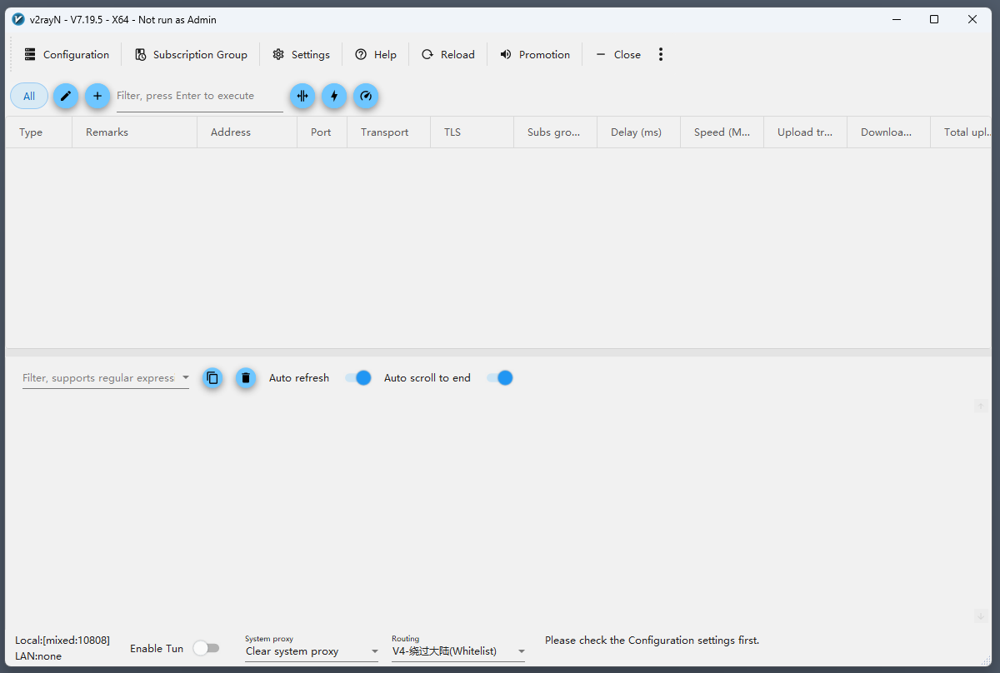

Переключимся на русский язык.

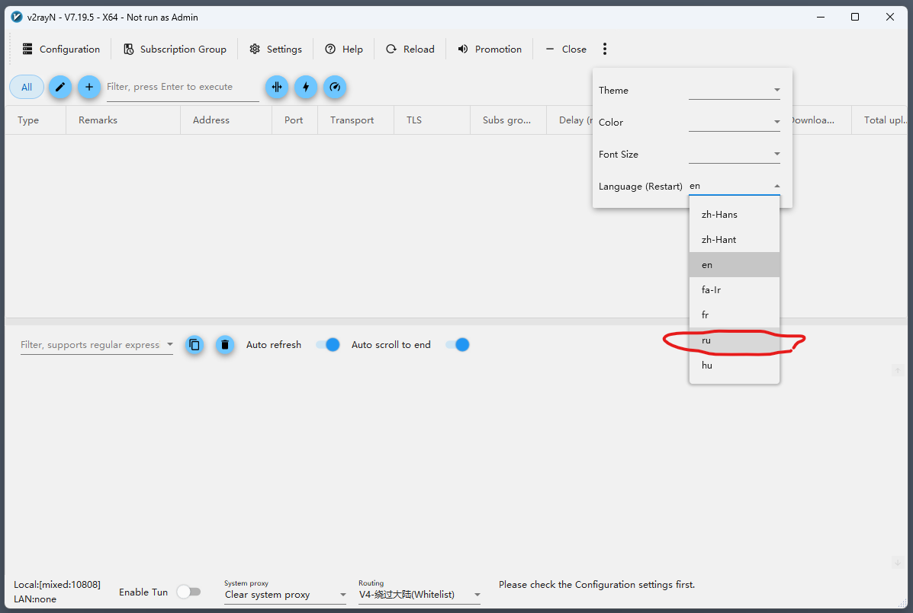

Переключимся на российские установки.

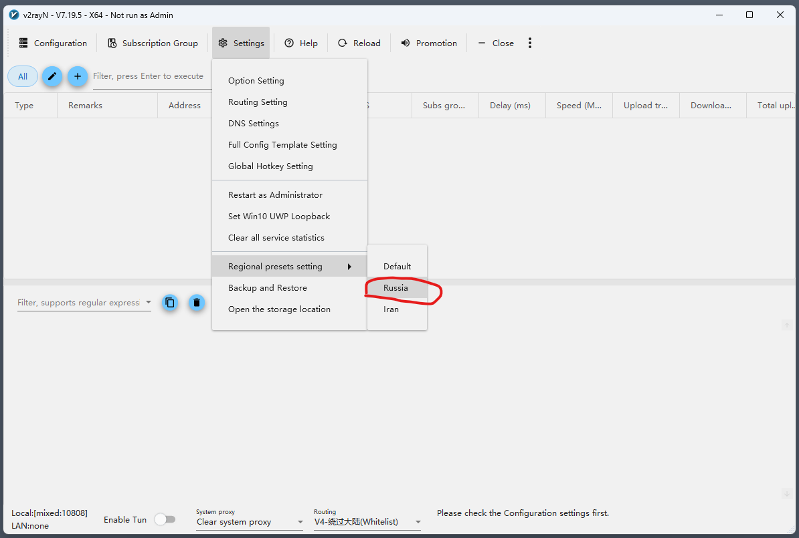

Перезагрузим программу из панели задач — выйдем из нее и снова запустим.

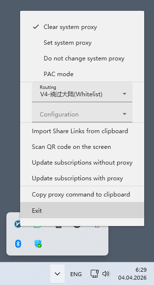

Переключим маршрутизацию. Если такой пункт отсутствует, 
подождем немного загрузки, через минуту он появится.

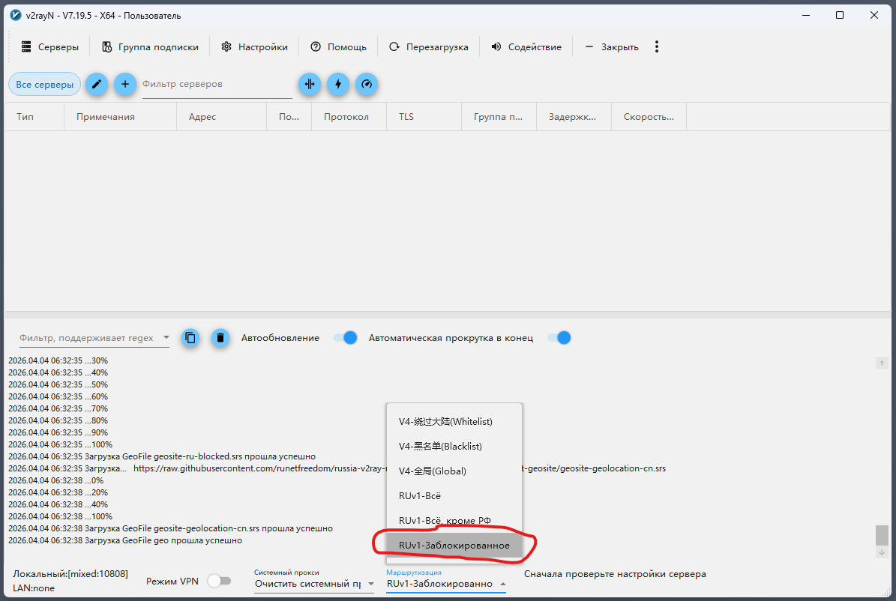

Если есть ссылка для подключения, то копируем ее в буфер обмена и подключаем.

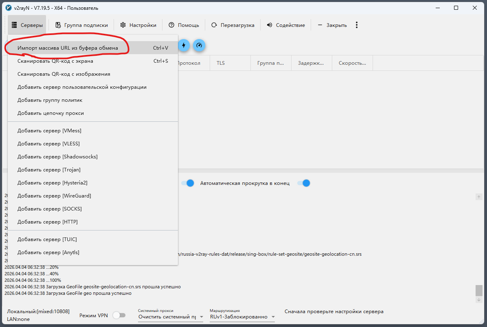

Если ссылки нет, то создавайте подключение вручную в соответствии с вашими
настройками прокси-сервера.

*Обычно они находятся в файле config.json*

Рассмотрим подключение к прокси-серверу по протоколу *VLESS*.

Создаем подключение.

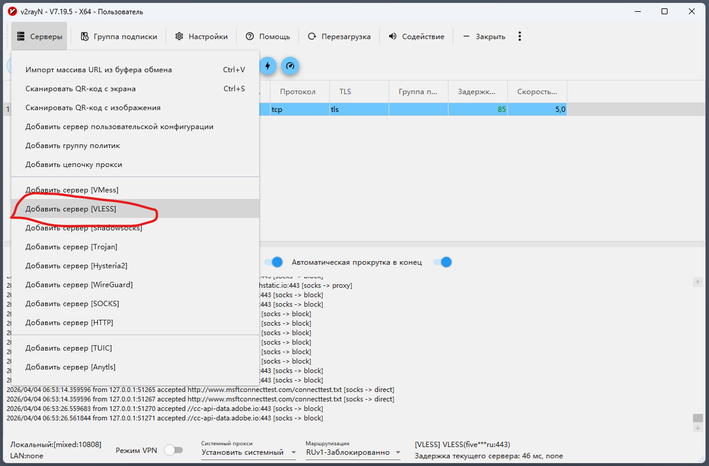

И заполняем поля.

*Примечание — любое осмысленное название вашего подключения*

*Адрес — это адрес вашего прокси-сервера*

*UUID — это id клиента из config.json*

*Поток — то что указано в поле flow клиента файла config.json*

*Транспортный протокол сети — то, что указано streamSettings -> network файла config.json*

*TLS — то, что указано streamSettings -> security файла config.json*

*ALPN — то, что указано streamSettings -> tlsSettings -> alpn файла config.json*

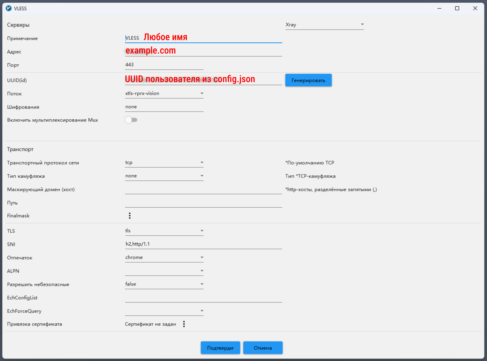

*Подключения по протоколам ShadowSocks и VLESS over Websocket теперь считаются небезопасными и устаревшими и в будущих
версиях **Xray** будут удалены. В клиенте **V2rayN** уже сейчас они, хоть и работают, но тесты уже не проходят.*

Включаем наш прокси в системе.

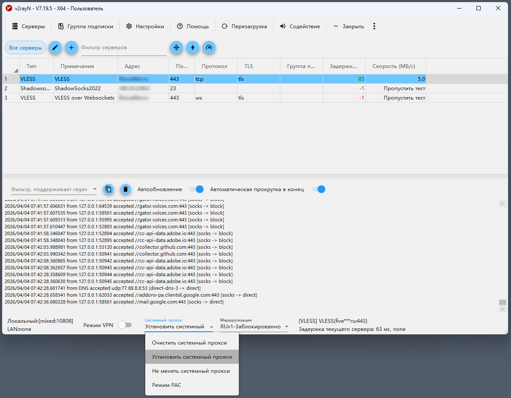

Проверяем, что все работает правильно:

* Определяем **IP** на [российском сайте](https://2ip.ru/) - должен быть определен как ip вашего провайдера, местоположение должно быть Россия
* Определяем **IP** на [на другом сайте](https://whoer.net/ru) - должен быть определен как ip вашего vds сервера, местоположение должно быть Нидерланды

Если все так и есть, значит прокси и маршрутизация работают))


<a name="clients-android">

## Установка клиента для *Android*

Переходим на [страницу](https://github.com/2dust/v2rayNG/releases) и находим релиз с пометкой *Latest*. На момент написания это был 2.0.18

Нажимаем на зеленую кнопку **Latest**. В разделе Assets находим пакет для своей платформы
(в большинстве случаев это будет arm64-v8a) и скачиваем его и устанавливаем.

Я устанавливал [этот](https://github.com/2dust/v2rayNG/releases/download/2.0.18/v2rayNG_2.0.18-fdroid_arm64-v8a.apk).

Запускаем *v2rayNG* и переходим в настройки.

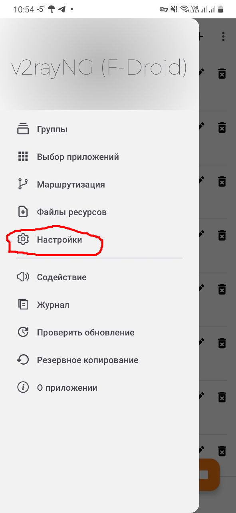

Там устанавливаем все как на скрине.

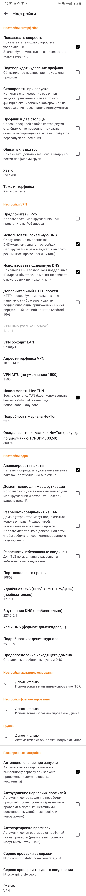

Установим файлы ресурсов.

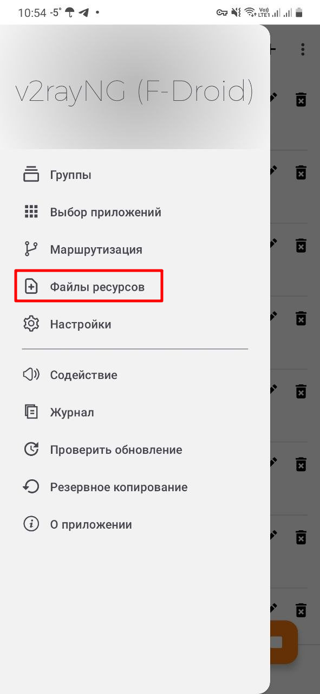

Устанавливаем источник геофайлов — *runetfreedom/russia-2ray-rules-dat*
и нажимаем кнопку загрузки

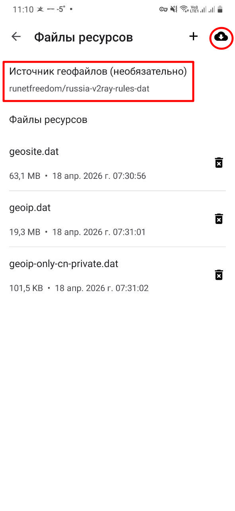

Приступаем к настройке маршрутизации.

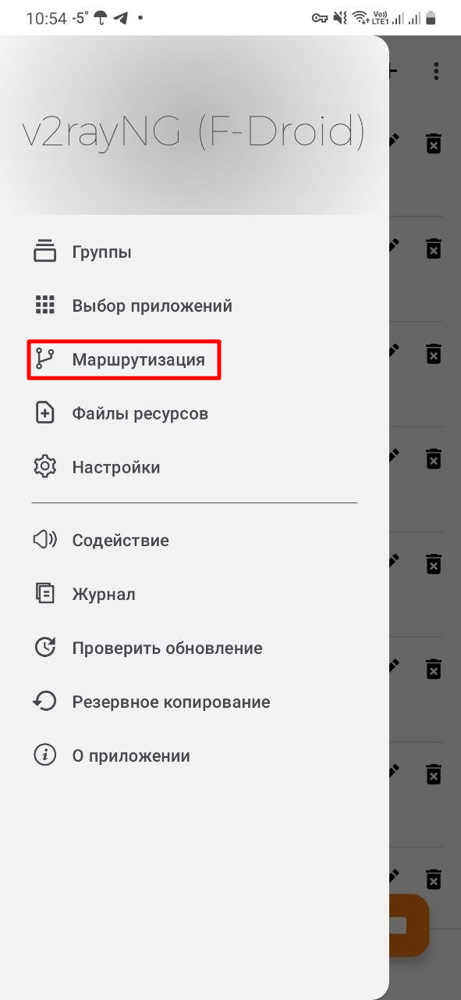

Копируем правила маршрутизации в буфер обмена.

```
[
    {
        "enabled":true,
        "ip":[
            "192.168.1.0/24",
            "192.168.11.0/24"
        ],
        "locked":false,
        "outboundTag":"direct",
        "remarks":"LAN DIrect"
    },
    {
        "enabled":true,
        "ip":[
            "geoip:private"
        ],
        "locked":false,
        "outboundTag":"direct",
        "remarks":"Direct LAN IP"
    },
    {
        "domain":[
            "geosite:private"
        ],
        "enabled":true,
        "locked":false,
        "outboundTag":"direct",
        "remarks":"Direct LAN domains"
    },
    {
        "domain":[
            "geosite:category-ru"
        ],
        "enabled":true,
        "locked":false,
        "outboundTag":"direct",
        "remarks":"Bypass Russia domains"
    },
    {
        "enabled":true,
        "ip":[
            "geoip:ru"
        ],
        "locked":false,
        "outboundTag":"direct",
        "remarks":"Bypass Russia IP"
        }
    ]
```

Вставляем правила маршрутизации.

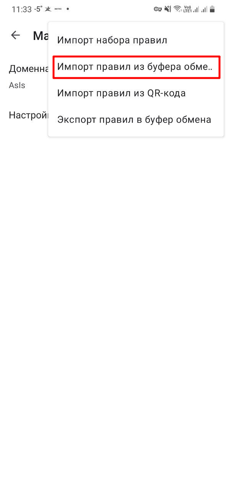

Должно получиться так:

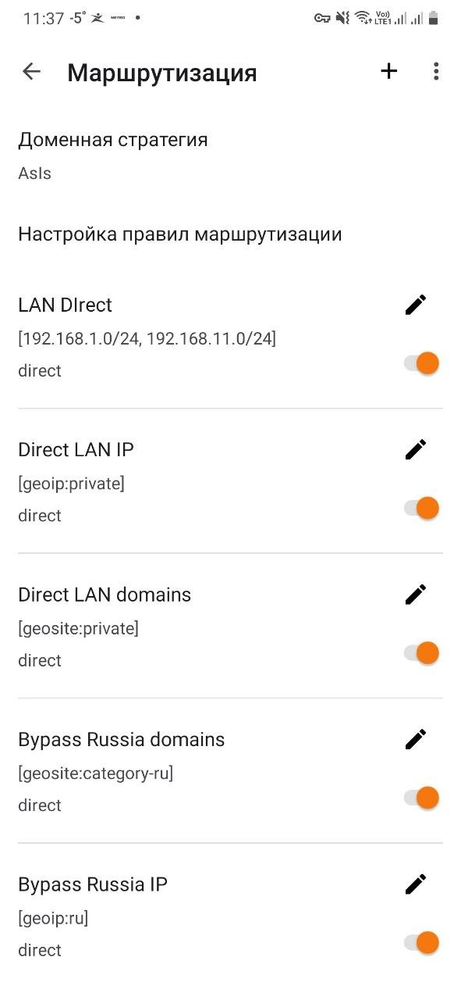

Все правила настроены.

Добавляем профили. Вручную добавлять не очень удобно на смартфоне.
В windows-клиенте профили уже созданы будем делиться ими — ПКМ на имени профиля
-> **Поделиться сервером**. Появится QR-код и стандартная ссылка. На смартфоне в 
**Профилях** справа вверху нажимаем **+** -> **Импорт из QR-кода**. Сканируем QR-код
на экране монитора. Профиль добавлен!

Нажимаем внизу справа кнопку запуска служб. После успешного запуска нажимаем на
строку **Соединено, нажмите для проверки**. После проверки должны получить время
задержки и ip адрес прокси-сервера.

Настраиваем приложения.

Переходим к выбору приложений, которые будут подключаться через прокси-сервер.

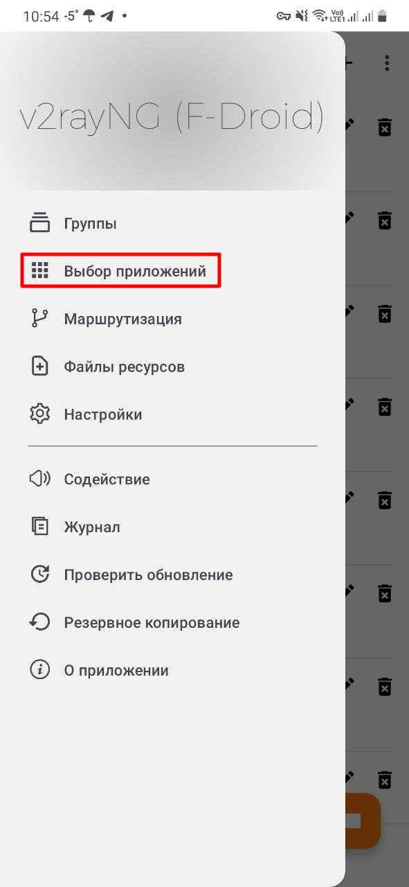

Включаем режим обхода и выбираем приложения, которые будут подключаться через
прокси-сервер.

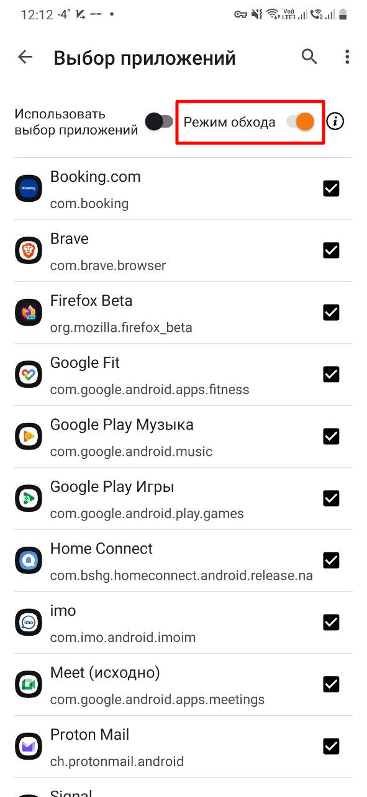

Проверим, что маршрутизация трафика работает правильно.

В браузере, который был подключен к прокси-серверу на предыдущем шаге, выполняем:

* Определяем **IP** на [российском сайте](https://2ip.ru/) - должен быть определен как ip вашего провайдера, местоположение должно быть Россия
* Определяем **IP** на [другом сайте](https://whoer.net/ru) - должен быть определен как ip вашего vds сервера, местоположение должно быть Нидерланды

Если все так и есть, значит прокси и маршрутизация работают))

У нас получилось настроить раздельное туннелирование приложений
с маршрутизацией трафика.


